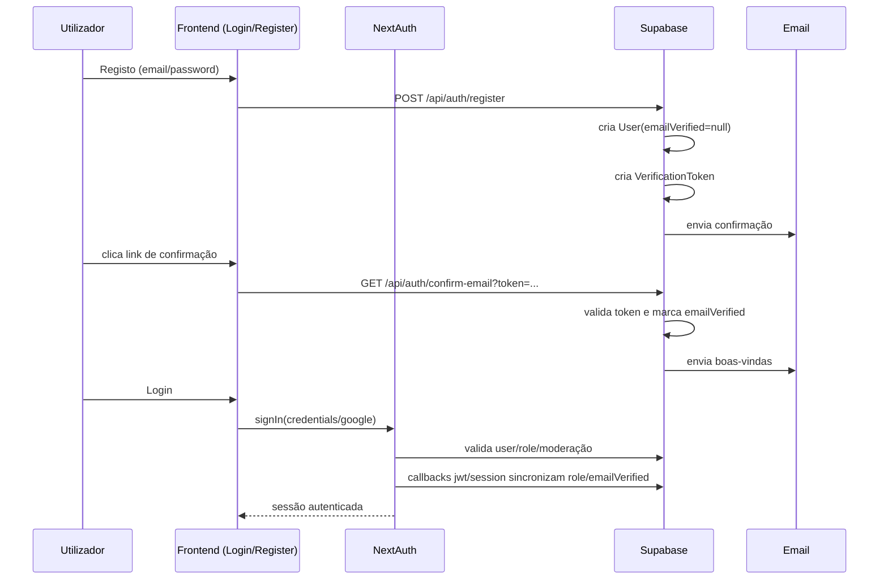

# Sistema de Utilizadores, Autenticação e Login (Cantólico)

> Documento técnico detalhado do estado **atual** da implementação no código.
> Baseado em análise dos módulos em `src/lib`, `src/app/api/auth`, `src/app/api/user`, `src/app/api/admin/users`, `src/components` e `src/proxy.ts`.

---

## 1) Visão Geral de Arquitetura

O sistema combina:

- **NextAuth** como orquestrador de autenticação e sessão.
- **Supabase (PostgreSQL)** como persistência de utilizadores, sessões, contas OAuth, tokens de verificação e moderação.
- **JWT Session Strategy** (não usa sessão stateful do NextAuth no browser; usa token assinado + callbacks para enriquecer sessão).
- **Múltiplas camadas de autorização**:
  - client-side (`useSession`, guards em páginas/components),
  - server-side (`getServerSession` em páginas/API),
  - middleware global (`src/proxy.ts`) para bloqueios/redirects,
  - wrappers utilitários para APIs (`withAdminProtection`, `requireAdmin`, etc.).
- **Sistema de segurança adicional**: monitorização de tentativas de login, bloqueio de IP em memória, alertas e logs de segurança.
- **Sistema de email** para confirmação, boas-vindas, alertas de login e recuperação de password.

---

## 2) Componentes-Chave (Mapa Mental)

### Núcleo de auth

- `src/lib/auth.ts`
  - define `authOptions` do NextAuth,
  - providers (`credentials` e `google`),
  - callbacks `jwt`, `session`, `signIn`,
  - integração com monitorização de segurança e envio de alertas.

- `src/lib/supabase-adapter.ts`
  - adapter custom do NextAuth para tabelas Supabase (`User`, `Account`, `Session`, `VerificationToken`).

- `src/app/api/auth/[...nextauth]/route.ts`
  - endpoint principal NextAuth (`GET` e `POST`).

### Tipagem e contrato da sessão

- `src/types/next-auth.d.ts`
  - estende `Session.user` com `id`, `role`, `emailVerified`.
  - estende `JWT` com `role` e `emailVerified`.

### Middleware global e gates

- `src/proxy.ts`
  - enforce de acesso a áreas protegidas,
  - bloqueio por role,
  - validação de email verificado,
  - redirects para `/login` ou `/`.

### Fluxos de conta

- `src/app/api/auth/register/route.ts`
- `src/app/api/auth/confirm-email/route.ts`
- `src/app/api/auth/resend-verification/route.ts`
- `src/app/api/auth/forgot-password/route.ts`
- `src/app/api/auth/reset-password/route.ts`

### Camada de UI/auth experience

- `src/components/forms/LoginForm.tsx`
- `src/components/forms/RegisterForm.tsx`
- `src/components/GoogleSignInButton.tsx`
- `src/components/EmailVerificationBanner.tsx`
- `src/components/AuthWrapper.tsx`
- `src/components/SessionProvider.tsx`

### API de user/admin relacionadas com identidade

- `src/app/api/user/profile/route.ts`
- `src/app/api/user/profile/update/route.ts`
- `src/app/api/user/email-verification-status/route.ts`
- `src/app/api/user/force-verify-oauth/route.ts`
- `src/app/api/user/moderation-status/route.ts`
- `src/app/api/user/delete-account/route.ts`
- `src/app/api/admin/users/**`

---

## 3) Modelo de Dados de Autenticação (tabelas principais)

Pelo adapter e tipos Supabase, os objetos centrais são:

- **`User`**
  - identidade primária,
  - `role` (`USER|TRUSTED|REVIEWER|ADMIN`),
  - `passwordHash` (quando conta local),
  - `emailVerified` (timestamp|null).

- **`Account`**
  - mapeia provedores OAuth (Google),
  - vincula provider account ao `userId`.

- **`Session`**
  - usada pelo adapter NextAuth para persistir sessões.

- **`VerificationToken`**
  - reutilizada para:
    - confirmação de email,
    - reset de password.

- **`UserModeration`** e **`ModerationHistory`**
  - estado atual e histórico de ações disciplinares.

---

## 4) Fluxo de Registo (Credentials)

## 4.1 Entrada no front

- `RegisterForm` envia `POST /api/auth/register` com `name`, `email`, `password`.
- Em caso de sucesso, redireciona para `/login`.

## 4.2 Processamento no backend (`/api/auth/register`)

1. valida payload básico;
2. verifica se `email` já existe;
3. cria hash com `bcrypt.hashSync(password, 10)`;
4. cria registo `User` com:
   - `passwordHash` preenchido,
   - `emailVerified = null` (não verificado);
5. gera token de verificação (`generateEmailVerificationToken`);
6. grava token em `VerificationToken`;
7. envia email de confirmação (`sendEmailConfirmation`).

**Resultado:** conta existe, mas com acesso funcional limitado enquanto email não for verificado.

---

## 5) Fluxo de Login (Credentials)

## 5.1 Entrada no front

- `LoginForm` chama `signIn("credentials", { redirect: false, email, password })`.

## 5.2 Provider credentials (`auth.ts` -> `authorize`)

O provider faz, na prática:

1. extrai `ip` e `user-agent`;
2. valida campos;
3. verifica bloqueio de IP (`isIPBlocked`);
4. consulta utilizador por email em `User`;
5. consulta moderação em `UserModeration`;
6. se `BANNED` ou `SUSPENDED` ativa, bloqueia login;
7. impede login por password para contas sem `passwordHash` (tipicamente OAuth);
8. compara password com `bcrypt.compareSync`;
9. regista tentativa no monitor de segurança (`trackLoginAttempt`);
10. grava logs de sucesso/falha;
11. envia alerta de login por email (`sendLoginAlert`);
12. retorna objeto user para NextAuth (`id`, `email`, `role`, `emailVerified`, etc).

---

## 6) Fluxo OAuth Google

## 6.1 No front

- `GoogleSignInButton` chama `signIn('google', ...)`.

## 6.2 Callback `signIn` no NextAuth

No `callbacks.signIn` para Google:

1. exige email válido;
2. tenta encontrar `User` por email;
3. se já existe:
   - verifica moderação (`UserModeration`),
   - recusa se ban/suspensão ativa,
   - atualiza `name`, `image` e força `emailVerified` para timestamp atual;
4. se não existe:
   - deixa adapter criar utilizador automaticamente;
5. regista logs e envia alertas de login.

## 6.3 Criação do utilizador no adapter

- `SupabaseAdapter.createUser` cria `User` com role default `USER`.
- `emailVerified` respeita o valor recebido do provider.
- envia boas-vindas **apenas** quando o provider já marcou email como verificado (evita duplicação de email de boas-vindas).

---

## 7) Sessão, JWT e Sincronização de Role

Configuração relevante (`auth.ts`):

- `session.strategy = 'jwt'`
- `maxAge = 30 dias`
- `updateAge = 5 minutos`

### Callback `jwt`

- no login inicial: salva `sub`, `role`, `picture`, `emailVerified` no token;
- em renovações: recarrega `role/emailVerified/image` da tabela `User`.

### Callback `session`

- sempre que sessão é materializada, busca `User` por `token.sub` e injeta:
  - `session.user.id`,
  - `session.user.role`,
  - `session.user.emailVerified`.

**Efeito prático:** alterações de role/verificação no banco refletem na sessão sem relogin imediato (em janela de atualização).

---

## 8) Verificação de Email

## 8.1 Confirmação

- URL de confirmação cai em `/auth/confirm-email?token=...`.
- A página client redireciona para `/api/auth/confirm-email?token=...`.
- API:
  1. valida token em `VerificationToken`;
  2. valida expiração;
  3. busca `User` pelo `identifier` (email);
  4. se não verificado, atualiza `emailVerified`;
  5. remove token;
  6. envia email de boas-vindas se aplicável;
  7. redireciona com `status=success`.

## 8.2 Banner global de verificação

`EmailVerificationBanner` em `app/layout.tsx`:

- aparece para utilizador autenticado não verificado;
- permite:
  - reenviar email (`/api/auth/resend-verification`),
  - correção rápida para contas Google (`/api/user/force-verify-oauth`).

## 8.3 Reenvio

`/api/auth/resend-verification`:

- exige sessão;
- valida email da sessão;
- impede reenvios muito frequentes (lógica de cooldown ~10 min);
- recria token e envia email.

---

## 9) Recuperação de Password

## 9.1 Solicitação (`forgot-password`)

- entrada: email.
- se utilizador não existir: resposta genérica de sucesso (evita enumeração).
- se utilizador tiver `Account` OAuth: também retorna sucesso genérico sem enviar reset.
- caso válido:
  - gera token aleatório,
  - grava em `VerificationToken`,
  - envia email com link para `/auth/reset-password?token=...`.

## 9.2 Reset (`reset-password`)

- valida token + validade;
- busca utilizador por email associado ao token;
- gera hash da nova password;
- atualiza utilizador;
- invalida sessões;
- remove token.

> Nota: ver “Pontos de Atenção” no fim para detalhes de consistência nessa rota.

---

## 10) Camadas de Autorização (quem pode entrar onde)

## 10.1 Client-side

- diversos componentes/páginas usam `useSession()` para UI conditional e redirects.
- exemplos: páginas de criação, admin dashboard, logs, playlists, etc.

## 10.2 Server-side

- APIs e páginas server usam `getServerSession(authOptions)` para validar user/role.

## 10.3 Middleware global (`proxy.ts`)

Regras importantes:

- bloqueia acesso a `/admin` sem token;
- exige `ADMIN`/`REVIEWER` para áreas administrativas;
- restringe certas subrotas admin para `ADMIN` apenas;
- para paths protegidos (`/musics/create`, `/playlists/create`, `/users/profile`, etc.), exige `emailVerified`;
- bloqueia `/logs` para não-admin;
- se conta Google estiver sem `emailVerified`, tenta auto-correção via tabela `Account`.

## 10.4 Wrappers utilitários

- `withAdminProtection` (`enhanced-api-protection.ts`): gate de role + logging + performance.
- `requireAdmin`/`requireReviewer` (`admin-auth.ts`): helper rápido para APIs.
- `withApiProtection`/`withAuthApiProtection` (`api-middleware.ts`): protege origem + autenticação.

---

## 11) Moderação de Utilizadores (WARNING/SUSPENDED/BANNED)

## 11.1 Fontes de verdade

- estado atual: `UserModeration`
- histórico: `ModerationHistory`

## 11.2 Efeito no login

- no login credentials e Google, se `BANNED` ou `SUSPENDED` ativa -> acesso negado.
- suspensão expirada pode ser auto-reativada para `ACTIVE`.

## 11.3 API de status

- `/api/user/moderation-status` devolve status atual.
- também auto-resolve suspensão expirada.

## 11.4 UX de banimento

- página `/banned` valida status e mostra motivo/data.
- oferece logout e contacto para recurso.

---

## 12) Gestão de Conta do Utilizador

## 12.1 Perfil

- `/api/user/profile`: verifica providers vinculados (Google etc).
- `/api/user/profile/update`: atualiza `name`, `bio`, `image`.

## 12.2 Eliminação de conta (`/api/user/delete-account`)

Suporta:

- auto-eliminação,
- eliminação administrativa (com regras).

Processo inclui:

1. valida sessão/permissão;
2. recolhe stats para auditoria;
3. apaga tokens, sessões, accounts OAuth, favoritos e playlists;
4. remove músicas pendentes/rejeitadas;
5. anonimiza músicas aprovadas;
6. apaga utilizador;
7. loga evento completo.

---

## 13) Gestão Administrativa de Utilizadores

`/api/admin/users/**` cobre:

- listagem paginada + filtros por role/status;
- atualização de role;
- eliminação;
- moderação (warning/suspensão/ban) com envio de email;
- resumo por utilizador (`songs/playlists/stars/sessions/logs/accounts`);
- envio de reset password por admin.

Papéis:

- `ADMIN`: tudo,
- `REVIEWER`: ações limitadas (ex.: warning, sem ban/suspensão em algumas rotas).

---

## 14) Logging, Monitorização e Segurança

## 14.1 Login monitor

`login-monitor.ts` implementa:

- janela de observação (30 min),
- thresholds de falha,
- bloqueio de IP em memória,
- alertas de segurança para padrões suspeitos,
- persistência parcial de tentativas em tabela de logs.

## 14.2 Logging de APIs e middleware

- `api-route-wrapper.ts`: request start/end/error, correlação e métricas de latência.
- `proxy.ts`: logs HTTP e acessos proibidos.
- `enhanced-api-protection.ts`: logs de ações críticas administrativas.

## 14.3 Alertas por email

- boas-vindas,
- confirmação de email,
- reset de password,
- alerta de login normal/admin,
- alertas de segurança.

---

## 15) Variáveis de Ambiente Relevantes

- `NEXTAUTH_SECRET`
- `GOOGLE_CLIENT_ID`
- `GOOGLE_CLIENT_SECRET`
- `NEXT_PUBLIC_SUPABASE_URL`
- `NEXT_PUBLIC_SUPABASE_ANON_KEY`
- `SUPABASE_SERVICE_ROLE_KEY`
- `RESEND_API_KEY`
- `EMAIL_FROM`
- `SECURITY_EMAIL`

Sem estas variáveis, os fluxos falham parcial ou totalmente (auth, adapter, email, admin operations).

---

## 16) Sequência dos Fluxos (resumo visual)

---

## 17) Pontos de Atenção Técnicos (com base no código atual)

1. **Inconsistência potencial no reset de password (campo de user):**
   - em `/api/auth/reset-password`, update usa `password` (não `passwordHash`).
   - o login credentials valida `passwordHash`.
   - risco: password redefinida não surtir efeito para login credentials se coluna correta for `passwordHash`.

2. **Inconsistência potencial ao invalidar sessões no reset:**
   - delete usa `.eq('user_id', user.id)`;
   - adapter usa coluna `userId` em `Session`.
   - risco: sessões antigas não serem invalidadas.

3. **Chamada potencialmente invertida em envio de reset email:**
   - assinatura `sendPasswordResetEmail(userEmail, userName, resetToken, ...)`;
   - em duas rotas, chamada aparenta enviar argumentos em ordem diferente.
   - risco: email de reset falhar ou receber destinatário incorreto.

4. **Rate limit de login em memória (`Map`):**
   - perde estado em restart/scale horizontal.
   - em produção distribuída, o ideal é Redis ou mecanismo centralizado.

5. **Duplicação/variação de wrappers de proteção:**
   - coexistem múltiplos padrões (`requireAdmin`, `withAdminProtection`, checks locais).
   - aumenta superfície de divergência de política de autorização.

---

## 18) Recomendações de Evolução (roadmap técnico)

- unificar política de auth/authorization em wrappers únicos e reutilizados;
- consolidar reset password para usar campos corretos e invalidar sessão de forma garantida;
- mover login-rate-limit para store distribuída (Redis);
- padronizar naming e contratos de tabelas/colunas (`userId` vs `user_id`);
- adicionar testes E2E de auth críticos:
  - register + verify + login,
  - google login + emailVerified,
  - forgot/reset password,
  - bloqueio por moderação,
  - autorização ADMIN/REVIEWER.

---

## 19) Conclusão

O sistema atual é robusto em cobertura funcional: suporta credentials e Google OAuth, verificação de email, recuperação de conta, moderação e gestão administrativa com logging intenso e camadas múltiplas de proteção.

Os principais riscos concentram-se em **consistência operacional** (algumas rotas específicas de reset/sessão) e em **distribuição** (rate-limit em memória). Fora isso, a arquitetura base de identidade/autorização está bem estruturada e extensível.
